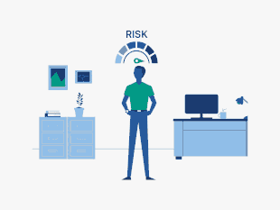

<!-- TABLE OF CONTENTS -->
# Technology risk at UNAM

<!-- PROJECT LOGO -->
<br />
<div align="center">
  <a href="" id= "readme-top">
    
  </a>


****

  <p align="center">
    In this repository you'll find all the homework associated with our concurrent computing course!
    <br />
  </p>
</div>


<!-- TABLE OF CONTENTS -->
# Table of Contents
- [Technology risk at UNAM](#technology-risk-at-unam)
- [Table of Contents](#table-of-contents)
- [Introduction](#introduction)
- [Technology Risk](#technology-risk)
  - [Course Description:](#course-description)
  - [What is Technology Risk?](#what-is-technology-risk)
  - [Course Objectives:](#course-objectives)
  - [Teacher](#teacher)
  - [Teaching Assistants](#teaching-assistants)
- [Getting Started](#getting-started)
    - [Recommended software \& tools](#recommended-software--tools)
    - [Prerequisites](#prerequisites)
    - [Installation](#installation)
- [Homework Assignments](#homework-assignments)
  - [Practice 1](#practice-1)
    - [Running the practices](#running-the-practices)
- [Test Assignments](#test-assignments)
- [The Students team](#the-students-team)
    - [Yonathan Berith Jaramillo Ramírez.](#yonathan-berith-jaramillo-ramírez)


<!-- ABOUT THE PROJECT -->
# Introduction

<p align="center">
  <table>
    <tr>
      <td></td>
      <td></td>
    </tr>
  </table>
</p>


# Technology Risk

## Course Description:

In today's digitally driven environment, understanding and managing technological risks is paramount for organizations across all industries. This course delves deep into the multifaceted landscape of technology risks, providing students with the theoretical foundation and practical skills necessary to identify, assess, and manage these risks within both established and emerging technological ecosystems.

## What is Technology Risk?

Technology risk refers to the potential for loss or harm related to technical systems, processes, or platforms, or due to technology failures or shortcomings. Here's a comprehensive categorization:

1. **Cybersecurity Risk**
- Unauthorized access, use, disclosure, disruption, modification, or destruction of information.
- Threats from hackers, malware, phishing attacks, and other cyber threats.

2. **Operational Risk**
- Risks associated with internal processes, people, and systems.
- System downtimes, software misconfigurations, hardware failures, and inadequate backup processes.

3. **Project Risk**
- Potential for failure in the development and implementation of new IT projects or systems.
- Scope creep, budget overruns, failure to meet project milestones.

4. **Reputation Risk**
- Resulting from negative public opinion due to technology-related incidents.
- Data breaches leading to a loss of trust among customers or stakeholders.

5. **Compliance and Legal Risks**
- Potential for legal repercussions due to failure to comply with laws, regulations, or standards.
- Examples include data protection regulations like the GDPR.

6. **Vendor and Third-party Risks**
- Risks arising when external parties, such as software providers or cloud service providers, fail to meet their obligations.
- System vulnerabilities or operational disruptions.

7. **Emerging Technology Risks**
- Risks associated with new technologies like artificial intelligence, Internet of Things (IoT), and blockchain.
- Increased potential for device vulnerabilities with IoT.

8. **Strategic Technology Risks**
- Risks related to making incorrect or suboptimal strategic decisions regarding technology.
- Investing in a technology that becomes quickly outdated or isn't aligned with business objectives.

9. **Financial Technology Risks**
- Failures in financial software or platforms.
- Incorrect financial reporting or transaction processing errors.

10. **Disaster Risks**
- Risks related to natural disasters such as floods, earthquakes, or fires impacting technology infrastructure.

Proper technology risk management entails identifying potential technology-related risks, assessing their impact, and developing strategies to mitigate them, ensuring that organizations can effectively leverage technology while minimizing potential vulnerabilities.


## Course Objectives:
1. Introduce students to the broad spectrum of technological risks in the context of modern business operations.
2. Equip students with tools and methodologies for effective risk assessment and management.
3. Instill a proactive mindset, emphasizing the importance of preventative measures and contingency planning.


## Teacher 
- Glide Valeria Rodriguez Jimenez

## Teaching Assistants
- Itzel Azucena Delgado Díaz
- Luis Angel Rojas Espinoza


<!-- GETTING STARTED -->
# Getting Started

<div align = "center">
 
</div>


This is an example of how you may give instructions on setting up your project locally.
To get a local copy up and running follow these simple example steps.

### Recommended software & tools

- Terminal: [Oh my zsh!](https://ohmyz.sh/) & [Terminator](https://terminator-gtk3.readthedocs.io/en/latest/)
- Code editor: [Visual Studio Code](https://code.visualstudio.com/)
- Operating System: [Ubuntu 23.04](https://ubuntu.com/download/desktop)


### Prerequisites

This is an example of how to list things you need to use the software and how to install them.

<!-- Center-aligned table containing logos and installation links -->
<div align="center">

  <!-- Logos -->
  

  <!-- Installation Links -->
  
  | [Maven Installation](https://maven.apache.org/install.html) |

</div>


### Installation

1. Clone the repo:
   
    With https:
   ```sh
   git clone https://github.com/Yony6041/technology-risk.git
    With ssh:

   ```sh
   git clone git@github.com:Yony6041/technology-risk.git
   ```


<p align="right">(<a href="#readme-top">back to top</a>)</p>


# Homework Assignments
<div align = "center">
 
</div>

## Practice 1
<p align="right">(<a href="#readme-top">back to top</a>)</p>

### Running the practices


<p align="right">(<a href="#readme-top">back to top</a>)</p>


# Test Assignments

The tests pdfs can be found at exams/exam(x)/exam(x).pdf


# The Students team 


### Yonathan Berith Jaramillo Ramírez.
Computer scientist
- [Github](https://github.com/Yony6041)
- [LinkedIn](https://www.linkedin.com/in/yonathan-jaramillo-a506181a7/?originalSubdomain=mx)


<p align="right">(<a href="#readme-top">back to top</a>)</p>
